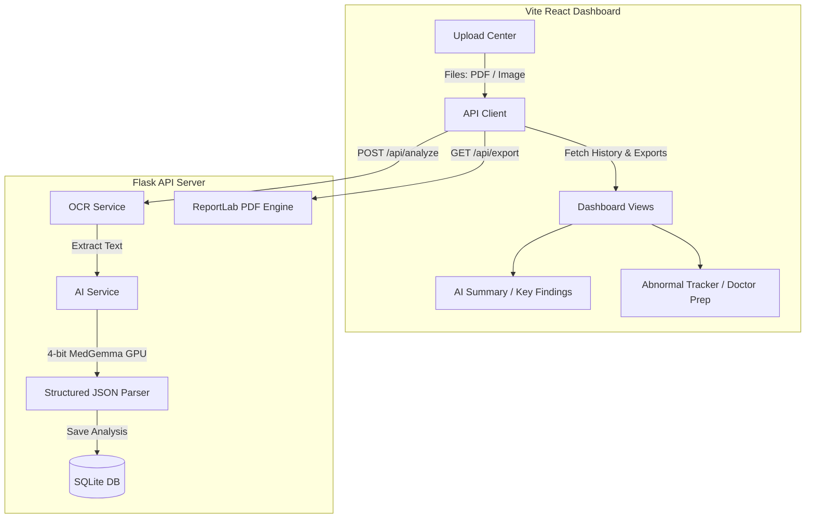

# 🏥 HealthDecode: AI-Powered Medical Second-Opinion Assistant

HealthDecode is a premium, full-stack patient education dashboard designed to translate complex medical scans and clinical reports into plain, easy-to-understand language. It helps patients prepare for consultations and ask the right questions, without providing medical diagnoses or prescribing treatments.

Built with **React (Vite)** on the frontend and a **Flask (Python) API** on the backend, HealthDecode runs a 4-bit quantized **MedGemma 4B** AI model directly on the local GPU with OCR support for both PDFs and images.

---

## 🎥 Project Demo Video

Below is a demonstration of HealthDecode's dashboard, report uploading, automated OCR text extraction, dynamic medical summary tab panels, and ReportLab PDF document export:

<p align="center">
  <video src="demo_video.mp4" width="100%" controls></video>
</p>
[
*(If the video does not play automatically in your browser, you can access the file directly at [demo_video.mp4](./demo_video.mp4))*
](https://github.com/svharini2929/HealthDecode/releases/tag/v1.0.0)


---

## ✨ Key Features

*   **⚡ Local GPU Inference**: Runs the gated `google/gemma-2-2b-it` model locally on an NVIDIA GPU using 4-bit NF4 quantization to minimize memory footprint.
*   **🔍 Robust OCR Pipeline**: Uses `pdfplumber` for digital PDFs and `pytesseract` / Pillow (PIL) for scanned reports or lab result images.
*   **📋 Actionable Patient Insights**:
    *   **AI Summary**: Patient-friendly explanations of complex clinical findings.
    *   **Key Findings Checklist**: Structured summaries of visual observations.
    *   **Abnormal Values Tracker**: Extracts out-of-range parameters and displays them alongside standard reference ranges.
    *   **Doctor Prep Checklist**: Generates a checklist of personalized questions to help patients prepare for consultations.
*   **🌍 Multi-Language Translation**: Live language switching (English, Spanish, French, German) for all interface text.
*   **📄 PDF Document Exporter**: Generates beautifully formatted ReportLab PDFs for clinical summaries and doctor discussion sheets.
*   **🛡️ Safety & Clinical Bounding**: Built-in un-dismissible warning banners and strict model prompts ensuring no diagnoses or prescriptions are generated.
*   **🌙 Dark Mode Support**: Fully responsive dark/light theme options tailored for modern healthcare aesthetics.

---

## 💻 Tech Stack

### **Frontend**
*   **Framework**: React 18 + Vite (for fast, optimized HMR compilation)
*   **Styling**: Tailwind CSS v3 (medical-teal and hospital-blue color palettes)
*   **Icons**: Lucide React

### **Backend**
*   **Framework**: Python Flask + Flask-CORS
*   **Database**: SQLite (SQLAlchemy / sqlite3 standard driver)
*   **AI Engine**: PyTorch + Hugging Face Transformers & Accelerate
*   **Model Optimization**: bitsandbytes NF4 4-bit Quantization
*   **Text Extraction**: pdfplumber, pytesseract, Pillow
*   **PDF Generation**: ReportLab PDF Toolkit

---

## 📐 System Architecture



---

## 🚀 Getting Started (Installation & Setup)

### Prerequisites
*   Windows 10/11 with **WSL2** installed (Ubuntu 22.04 LTS recommended).
*   **NVIDIA GPU** with CUDA support.
*   Node.js (v18+) and Python (v3.10+) installed inside WSL.
*   A Hugging Face account and User Access Token to download `google/gemma-2-2b-it`.

---

### 1. Backend Setup (Flask API)

1.  Open your WSL terminal and navigate to the backend folder:
    ```bash
    cd backend
    ```

2.  Create and activate a virtual environment:
    ```bash
    python3 -m venv venv
    source venv/bin/activate
    ```

3.  Install dependencies:
    ```bash
    pip install -r requirements.txt
    ```

4.  Configure your environment. Create a `.env` file in the `backend/` directory:
    ```env
    HUGGING_FACE_HUB_TOKEN="your_hf_access_token_here"
    MODEL_ID="google/gemma-2-2b-it"
    FORCE_SIMULATOR=false
    ```

5.  Start the Flask server on port 5000:
    ```bash
    python3 app.py
    ```

---

### 2. Frontend Setup (React Dev Server)

1.  Open a new terminal window, navigate to the frontend folder:
    ```bash
    cd frontend
    ```

2.  Install packages:
    ```bash
    npm install
    ```

3.  Launch the development server:
    ```bash
    npm run dev
    ```

4.  Open [http://localhost:5173](http://localhost:5173) in your browser.

---

## 🛡️ Safety Warning & Legal Disclaimer
HealthDecode is built strictly for patient education and informational preparation. Under no circumstances does it provide medical advice, establish diagnoses, suggest drug dosages, or substitute for professional medical consultations.
